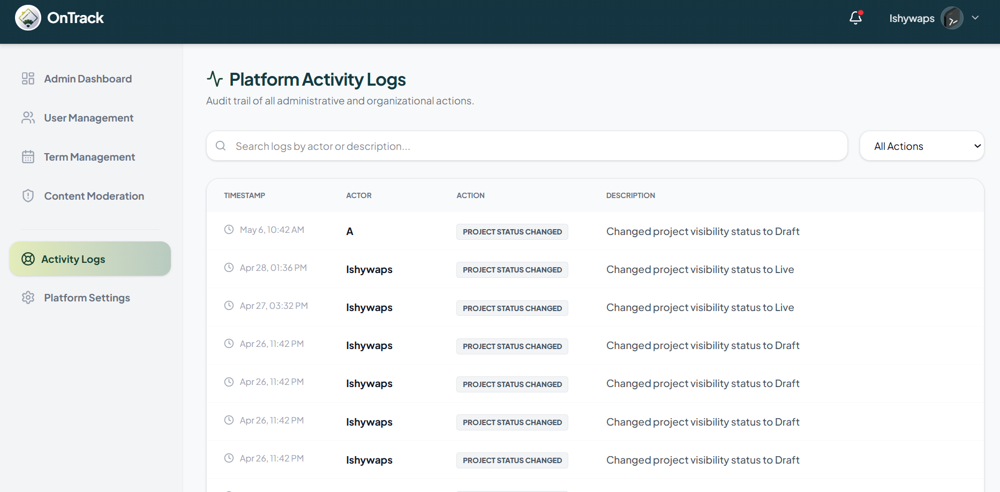

    <table width="100%" cellpadding="10" cellspacing="0" style="font-family: Arial, sans-serif; border-collapse: collapse;">
        <tr>
            <td colspan="2" style="padding-bottom: 20px;">
                <h1 style="margin: 0;">Kiwi Soda</h1>
                
Target: `KS.010.001`

            </td>
        </tr>
        <tr>
            <td width="25%" valign="top" style="border: 1px solid #e0e0e0; border-right: none;">
                <h2 style="margin-top: 0;">Site Map</h2>
                <a href="/docs/viewer/project-homepage.md">Homepage</a>                   
                
<strong>1. Authentication & Identity</strong>

                <ul style="list-style-type: none; padding-left: 0; font-size: 0.9em;">
                    <li style="padding-left: 15px"> <a href="../auth/google-login.md"> Login with Google (FR 1.0) </a></li>
                </ul>
                
<strong>2. Student Viewer Hub</strong>

                <ul style="list-style-type: none; padding-left: 0; font-size: 0.9em;">
                    <li style="padding-left: 15px"> <a href="../viewer/dashboard.md"> Real-Time Dashboard (FR 2.0) </a></li>
                    <li style="padding-left: 15px"> <a href="../viewer/milestones.md"> Milestone Tracker (FR 2.1) </a></li>
                    <li style="padding-left: 15px"> <a href="../viewer/project-updates-hub.md"> Project Updates Hub (FR 3.0) </a></li>
                    <li style="padding-left: 15px"> <a href="../viewer/feedback.md"> Submit Feedback/Comments (FR 4.0) </a></li>
                    <li style="padding-left: 15px"> <a href="../viewer/chatbot.md"> FAQ Chatbot (FR 4.1) </a></li>
                    <li style="padding-left: 15px"> <a href="../viewer/project-follow-updates.md"> Project Follow Updates (FR 5.0) </a></li>
                    <li style="padding-left: 15px"> <a href="../viewer/subscription-notifier.md"> Subscription Notifier (FR 5.1) </a></li>
                </ul>
                
<strong>3. Officer Management Portal</strong>

                    <ul style="list-style-type: none; padding-left: 0; font-size: 0.9em;">
                        <li style="padding-left: 15px"> <a href="../project-manager/manage-projects.md"> Project Manager (FR 6.0) </a></li>
                        <li style="padding-left: 15px"> <a href="../project-manager/tasks.md"> Task Assignment (FR 6.1) </a></li>
                        <li style="padding-left: 15px"> <a href="../project-manager/timeline-monitor.md"> Timeline Monitor (FR 7.0) </a></li>
                        <li style="padding-left: 15px"> <a href="../project-manager/budget-tracker.md"> Budget Editor & Tracker (FR 8.0/8.1) </a></li>
                        <li style="padding-left: 15px"><a href="../project-manager/document-hub.md"> Document Hub (FR 9.0) </a></li>
                        <li style="padding-left: 15px"><a href="../project-manager/project-charts.md"> Progress Charts (FR 10.0) </a></li>
                        <li style="padding-left: 15px"> <a href="../project-manager/deadline-alerts.md"> Deadline Alerts (FR 11.0) </a></li>
                    </ul>
                    
<strong>4. Admin & System Control</strong>

                    <ul style="list-style-type: none; padding-left: 0; font-size: 0.9em;">
                        <li style="padding-left: 15px"> <a href="../admin/users.md"> User Role Management </a></li>
                        <li style="padding-left: 15px"> <a href="../admin/logs.md"> System Activity Logs </a></li>
                        <li style="padding-left: 15px"> <a href="../admin/settings.md"> Global Configuration </a></li>
                    </ul>
            </td>
            <td valign="top" style="border: 1px solid #e0e0e0; padding: 20px;">
                

                    <a href="docs/admin/" style=" text-decoration: none;">Admin</a> &gt; 
                    <a href="docs/admin/logs" style="color: #ac9e9e; font-weight: bold; text-decoration: none;">System Activity Logs</a>
                
           
                

                    
                

                <h2 style="margin-top: 0;">System Activity Logs</h2>
                
The System Activity Logs feature allows administrators to monitor and review actions performed within the OnTrack system. It records important activities such as user logins, role modifications, project updates, task assignments, and other system-related events.
                

                
This feature improves accountability, transparency, and system security by maintaining a detailed history of user actions and administrative operations. Administrators can review logs to monitor system usage, investigate issues, and ensure that activities within the platform are properly documented.

                <h3>Use Case Scenario</h3>
                <table border="1" width="100%" cellpadding="8" cellspacing="0" style="border-collapse: collapse; font-size: 0.9em; border: 1px solid #ddd;">
                    <tr>
                        <th width="30%" align="left">Actor(s)</th>
                        <td>Administrator</td>
                    </tr>
                    <tr>
                        <th align="left">Goal</th>
                        <td>To monitor and review recorded system activities and user actions within the OnTrack platform.</td>
                    </tr>
                    <tr>
                        <th align="left">Preconditions</th>
                        <td>
                            1. Administrator must be logged into the OnTrack system. 
                            2. Recorded activities must exist in the activity log database.
                        </td>
                    </tr>
                    <tr>
                        <th align="left">Main Scenario</th>
                         <td>
                            1. Administrator opens the System Activity Logs module. 
                            2. The system retrieves and displays recorded user and system activities. 
                            3. Administrator browses or filters activity records by user, action, or date. 
                            4. Administrator reviews details of specific logged activities. 
                            5. The system displays complete activity information for monitoring and auditing purposes.
                        </td>
                    </tr>
                    <tr>
                        <th align="left">Outcome</th>
                        <td> Administrator successfully monitors and reviews system activities, ensuring accountability and proper system management.</td>
                    </tr>
                </table>
            </td>
        </tr>
        <tr>
            <td colspan="2" align="center" style="padding-top: 30px; font-size: 0.8em; color: #999;">
                

                © 2026 Kinetix | OnTrack VSU SSC
            </td>
        </tr>
    </table>

