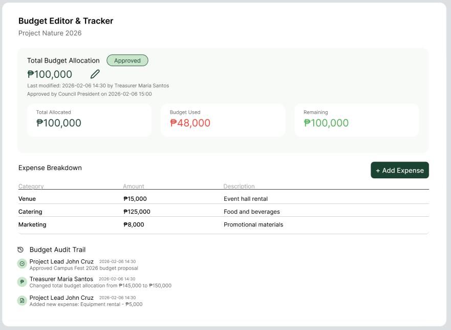

    <table width="100%" cellpadding="10" cellspacing="0" style="font-family: Arial, sans-serif; border-collapse: collapse;">
        <tr>
            <td colspan="2" style="padding-bottom: 20px;">
                <h1 style="margin: 0;">Kiwi Soda</h1>
                
Target: `KS.010.001`

            </td>
        </tr>
        <tr>
            <td width="25%" valign="top" style="border: 1px solid #e0e0e0; border-right: none;">
                <h2 style="margin-top: 0;">Site Map</h2>  
                <a href="/docs/viewer/project-homepage.md">Homepage</a>           
                
<strong>1. Authentication & Identity</strong>

                <ul style="list-style-type: none; padding-left: 0; font-size: 0.9em;">
                    <li style="padding-left: 15px"> <a href="../auth/google-login.md"> Login with Google (FR 1.0) </a></li>
                </ul>
                
<strong>2. Student Viewer Hub</strong>

                <ul style="list-style-type: none; padding-left: 0; font-size: 0.9em;">
                    <li style="padding-left: 15px"> <a href="../viewer/dashboard.md"> Real-Time Dashboard (FR 2.0) </a></li>
                    <li style="padding-left: 15px"> <a href="../viewer/milestones.md"> Milestone Tracker (FR 2.1) </a></li>
                    <li style="padding-left: 15px"> <a href="../viewer/project-updates-hub.md"> Project Updates Hub (FR 3.0) </a></li>
                    <li style="padding-left: 15px"> <a href="../viewer/feedback.md"> Submit Feedback/Comments (FR 4.0) </a></li>
                    <li style="padding-left: 15px"> <a href="../viewer/chatbot.md"> FAQ Chatbot (FR 4.1) </a></li>
                    <li style="padding-left: 15px"> <a href="../viewer/project-follow-updates.md"> Project Follow Updates (FR 5.0) </a></li>
                    <li style="padding-left: 15px"> <a href="../viewer/subscription-notifier.md"> Subscription Notifier (FR 5.1) </a></li>
                </ul>
                
<strong>3. Officer Management Portal</strong>

                <ul style="list-style-type: none; padding-left: 0; font-size: 0.9em;">
                    <li style="padding-left: 15px"> <a href="../project-manager/manage-projects.md"> Project Manager (FR 6.0) </a></li>
                    <li style="padding-left: 15px"> <a href="../project-manager/tasks.md"> Task Assignment (FR 6.1) </a></li>
                    <li style="padding-left: 15px"> <a href="../project-manager/timeline-monitor.md"> Timeline Monitor (FR 7.0) </a></li>
                    <li style="padding-left: 15px"> <a href="../project-manager/budget-tracker.md"> Budget Editor & Tracker (FR 8.0/8.1) </a></li>
                    <li style="padding-left: 15px"><a href="../project-manager/document-hub.md"> Document Hub (FR 9.0) </a></li>
                    <li style="padding-left: 15px"><a href="../project-manager/project-charts.md"> Progress Charts (FR 10.0) </a></li>
                    <li style="padding-left: 15px"> <a href="../project-manager/deadline-alerts.md"> Deadline Alerts (FR 11.0) </a></li>
                </ul>
                
<strong>4. Admin & System Control</strong>

                <ul style="list-style-type: none; padding-left: 0; font-size: 0.9em;">
                    <li style="padding-left: 15px"> <a href="../admin/users.md"> User Role Management </a></li>
                    <li style="padding-left: 15px"> <a href="../admin/logs.md"> System Activity Logs </a></li>
                    <li style="padding-left: 15px"> <a href="../admin/settings.md"> Global Configuration </a></li>
                </ul>
            </td>
            <td valign="top" style="border: 1px solid #e0e0e0; padding: 20px;">
                

                    <a href="../project-manager/" style=" text-decoration: none;">Projects</a> > 
                    <a href="../project-manager/charts.md" style="color: #ac9e9e; font-weight: bold; text-decoration: none;">Project Budget Editor</a>
                
   
                

                              
                

                <h2 style="margin-top: 0;">Project Budget Editor (FR 8.0)</h2>
                
The Project Budget Editor module enables authorized users to create, update, and manage financial allocations and expenditures for VSU SSC projects. It records budget amounts, expense entries, and modification history to ensure transparency, accuracy, and proper financial monitoring throughout the project lifecycle. In its initial implementation, the module will support (1)budget allocation and expense entry, (2)editing and updating of financial records with timestamps, and (3)automatic tracking of total budget versus actual spending. These features help maintain financial accountability and support informed decision‑making for project management.</h3>
                <table border="1" width="100%" cellpadding="8" cellspacing="0" style="border-collapse: collapse; font-size: 0.9em; border: 1px solid #ddd;">
                    <tr>
                        <th width="30%" align="left">Actor(s)</th>
                        <td>Project Manager, Lead Developer</td>
                    </tr>
                    <tr>
                        <th align="left">Goal</th>
                        <td>TTo allow authorized users to manage and monitor project budgets and expenses accurately.</td>
                    </tr>
                    <tr>
                        <th align="left">Preconditions</th>
                        <td>
                            1. The user is authenticated in the system. 
                            2. A project already exists and the user has permission to edit project budget information.
                        </td>
                    </tr>
                    <tr>
                        <th align="left">Main Scenario</th>
                        <td>
                            1. The user selects a project from the dashboard and opens the Project Budget Editor module. 
                            2. The system displays the current budget allocation and recorded expenses. 
                            3. The user adds, edits, or updates the expense entries and saves the changes. 
                            4. The system validates and stores the updated financial data and budget summary in real time.
                        </td>
                    </tr>
                    <tr>
                        <th align="left">Outcome</th>
                        <td> Project budget and expense information are successfully updated, stored, and made visible to authorized users for accurate financial tracking.</td>
                    </tr>
                </table>
            </td>
        </tr>
        <tr>
            <td colspan="2" align="center" style="padding-top: 30px; font-size: 0.8em; color: #999;">
                

                © 2026 Kinetix | OnTrack VSU SSC
            </td>
        </tr>
    </table>

