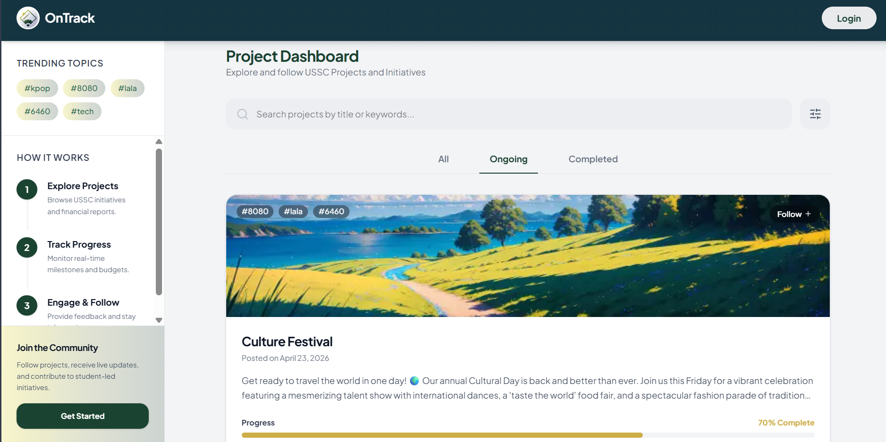

    <table width="100%" cellpadding="10" cellspacing="0" style="font-family: Arial, sans-serif; border-collapse: collapse;">
        <tr>
            <td colspan="2" style="padding-bottom: 20px;">
                <h1 style="margin: 0;">Kiwi Soda</h1>
                
Target: `KS.010.001`

            </td>
        </tr>
        <tr>
            <td width="25%" valign="top" style="border: 1px solid #e0e0e0; border-right: none;">
                <h2 style="margin-top: 0;">Site Map</h2>
                <a href="/docs/viewer/project-homepage.md">Homepage</a>                   
                
<strong>1. Authentication & Identity</strong>

                <ul style="list-style-type: none; padding-left: 0; font-size: 0.9em;">
                    <li style="padding-left: 15px"> <a href="../auth/google-login.md"> Login with Google (FR 1.0) </a></li>
                </ul>
                
<strong>2. Student Viewer Hub</strong>

                <ul style="list-style-type: none; padding-left: 0; font-size: 0.9em;">
                    <li style="padding-left: 15px"> <a href="../viewer/dashboard.md"> Real-Time Dashboard (FR 2.0) </a></li>
                    <li style="padding-left: 15px"> <a href="../viewer/milestones.md"> Milestone Tracker (FR 2.1) </a></li>
                    <li style="padding-left: 15px"> <a href="../viewer/project-updates-hub.md"> Project Updates Hub (FR 3.0) </a></li>
                    <li style="padding-left: 15px"> <a href="../viewer/feedback.md"> Submit Feedback/Comments (FR 4.0) </a></li>
                    <li style="padding-left: 15px"> <a href="../viewer/chatbot.md"> FAQ Chatbot (FR 4.1) </a></li>
                    <li style="padding-left: 15px"> <a href="../viewer/project-follow-updates.md"> Project Follow Updates (FR 5.0) </a></li>
                    <li style="padding-left: 15px"> <a href="../viewer/subscription-notifier.md"> Subscription Notifier (FR 5.1) </a></li>
                </ul>
                
<strong>3. Officer Management Portal</strong>

                    <ul style="list-style-type: none; padding-left: 0; font-size: 0.9em;">
                        <li style="padding-left: 15px"> <a href="../project-manager/project-manager.md"> Project Manager (FR 6.0) </a></li>
                        <li style="padding-left: 15px"> <a href="../project-manager/task-assignment.md"> Task Assignment (FR 6.1) </a></li>
                        <li style="padding-left: 15px"> <a href="../project-manager/timeline-monitor.md"> Timeline Monitor (FR 7.0) </a></li>
                        <li style="padding-left: 15px"> <a href="../project-manager/budget-tracker.md"> Budget Editor & Tracker (FR 8.0/8.1) </a></li>
                        <li style="padding-left: 15px"><a href="../project-manager/document-hub.md"> Document Hub (FR 9.0) </a></li>
                        <li style="padding-left: 15px"><a href="../project-manager/project-charts.md"> Progress Charts (FR 10.0) </a></li>
                        <li style="padding-left: 15px"> <a href="../project-manager/deadline-alerts.md"> Deadline Alerts (FR 11.0) </a></li>
                    </ul>
                    
<strong>4. Admin & System Control</strong>

                    <ul style="list-style-type: none; padding-left: 0; font-size: 0.9em;">
                        <li style="padding-left: 15px"> <a href="../admin/users.md"> User Role Management </a></li>
                        <li style="padding-left: 15px"> <a href="../admin/logs.md"> System Activity Logs </a></li>
                        <li style="padding-left: 15px"> <a href="../admin/settings.md"> Global Configuration </a></li>
                    </ul>
            </td>
            <td valign="top" style="border: 1px solid #e0e0e0; padding: 20px;">
                

                    <a href="../viewer/" style=" text-decoration: none;">Viewer Hub</a> &gt; 
                    <a href="../viewer/dashboard.md" style="color: #ac9e9e; font-weight: bold; text-decoration: none;">Real-Time Dashboard</a>
                
  
                <h3 style="text-align: left;">Viewer Dashboard (unauthorized)</h3>       
                

                    
                <h3 style="text-align: left;">Viewer Dashboard (authorized)</h3>
                

                    
                

                <h2 style="margin-top: 0; text-align: left">Real-Time Dashboard (FR 2.0)</h2>
                
The Viewer Dashboard provides students and guest users with a centralized overview of ongoing VSU USSC projects and activities. It displays summarized project progress, recent updates milestone statuses, and important announcements in a simple and accessible interface.
                

                

                The dashboard is designed to improve transparency by allowing students to monitor project developments without requiring administrative access or complex navigation.
                

                <h3 style="text-align: left;">Use Case Scenario</h3>
                <table border="1" width="100%" cellpadding="8" cellspacing="0" style="border-collapse: collapse; font-size: 0.9em; border: 1px solid #ddd;">
                    <tr>
                        <th width="30%" align="left">Actor(s)</th>
                        <td>Student Viewer, Guest User</td>
                    </tr>
                    <tr>
                        <th align="left">Goal</th>
                        <td>To view ongoing USSC projects, monitor project progress, and stay informed about organizational  updates and activities.</td>
                    </tr>
                    <tr>
                        <th align="left">Preconditions</th>
                        <td>
                            1. User must have internet access. 
                            2. User must access the ontrack dashboard. 
                            3. Registered student viewers must log in to access personaolized features.</td>
                    </tr>
                    <tr>
                        <th align="left">Main Scenario</th>
                        <td>
                            1. User opens the OnTrack Viewer Dashboard. 
                            2. The system loads current USSC project summaries and updates. 
                            3. User browses project cards, progress indicators, and milestone information. 
                            4. User selects a project to view more detailed updates and announcements. 
                            5. The system displays project-related information in real time.
                        </td>
                    </tr>
                    <tr>
                        <th align="left">Outcome</th>
                        <td>The user successfully views project progress and remains informed about ongoing VSU USSC initiatives and organizational activities..</td>
                    </tr>
                </table>
            </td>
        </tr>
        <tr>
            <td colspan="2" align="center" style="padding-top: 30px; font-size: 0.8em; color: #999;">
                

                © 2026 Kinetix | OnTrack VSU SSC
            </td>
        </tr>
    </table>

